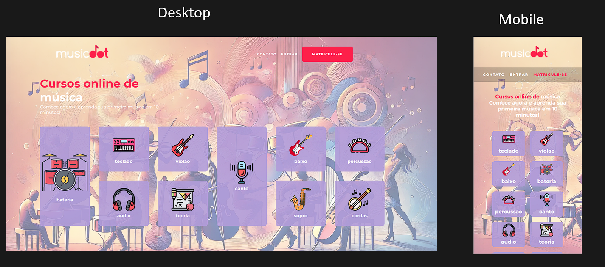

<h1 align="center" >Projeto Advice Generetor app</h1>

    

## Sobre
- Exericio inspirado em um print de um projeto de pagina de música do curso da plataforma Alura.   
- Como todo o exercício foi baseado em um print, não tive acesso às imagens originais, nem às dimensões dos botões ou das fontes, o que tornou o desafio ainda mais interessante. Tive que buscar imagens por conta própria e definir as medidas de forma independente, sem recorrer a ferramentas externas como o Figma, o que me permitiu aprimorar minha capacidade de adaptação e solução de problemas.

## Tecnologias Utilizadas 
- HTML 
- CSS

## Responsividade
- Para todos os tipos de dispositivos.

## Dificuldades deste projeto
- Tive muitas dificuldades nesse projeto, principalmente por se tratar do meu primeiro projeto solo envolvendo uma estrutura em Grid.
- Tive que fazer e refazer muitas vezes até atingir um resultado satisfatório, porem acredito que cheguei lá.
